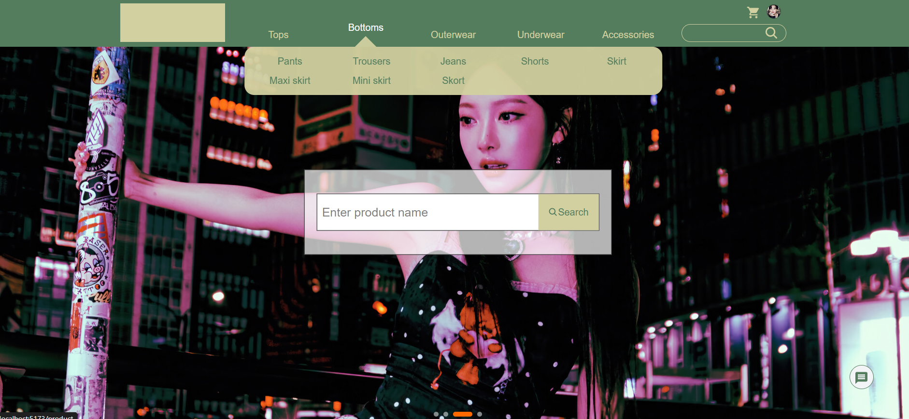
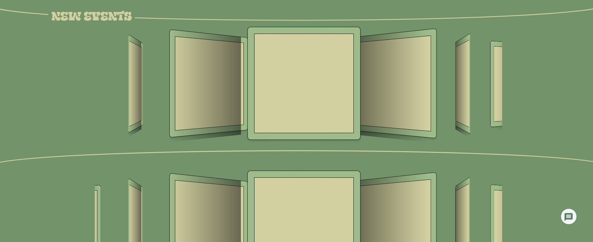
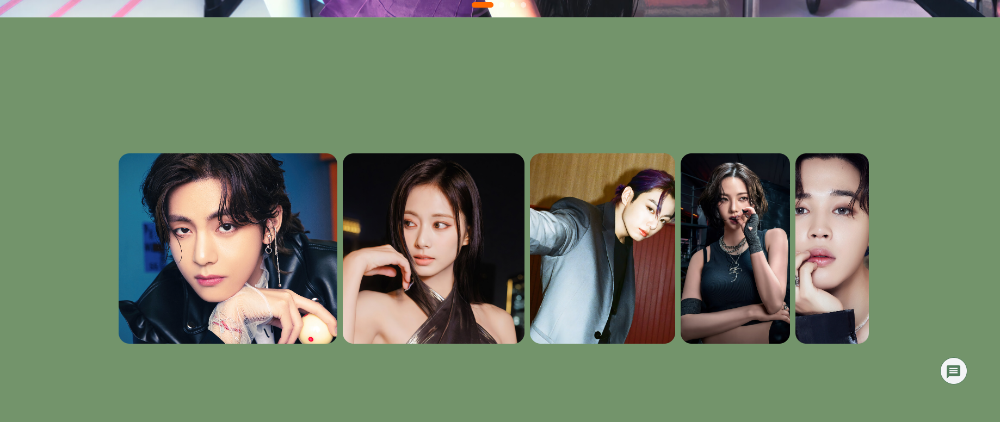
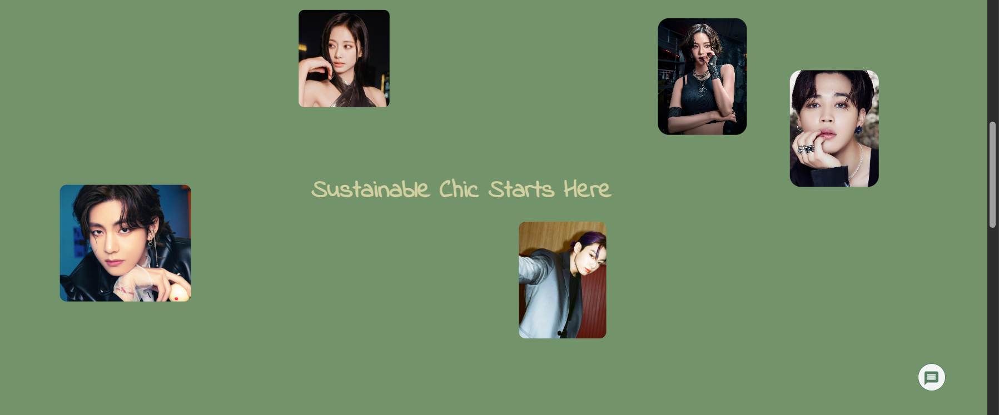
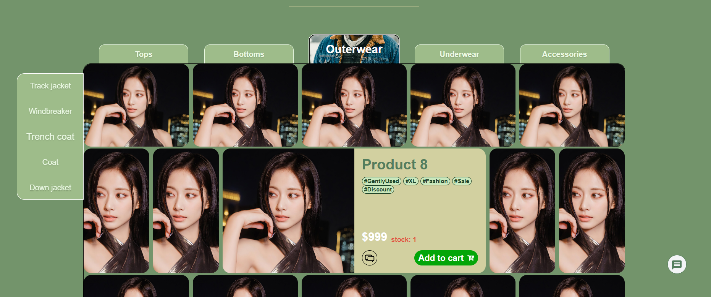
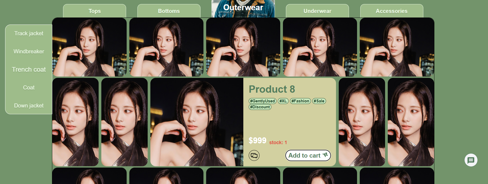
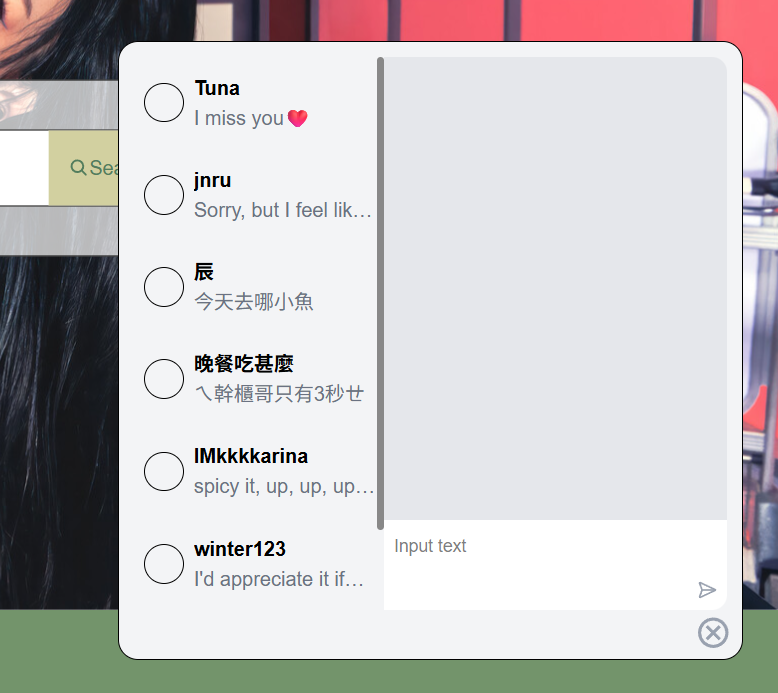
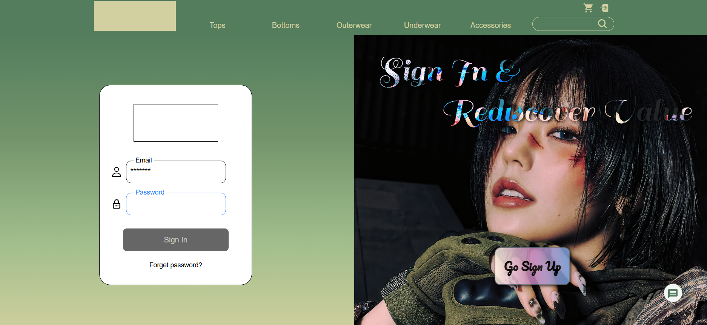

# Second-roject  
基本的後端功能串的差不多了  
接耶下來開搞web socket(ಥ _ ಥ)  
這是一個類似二手衣網站的東西  
除了優化First Project的後端功能完整性  
也會新增Socket.io來實現即時通訊  
這次將會嘗試善用Framer還有其餘JS套件來豐富UI  
目前嘗試出了很多想完成的動畫  
火力全開中💥  

# 用了套件Swiper.js做Carousal跟像翻牌的東西，然後Navbar用framer做了點互動

  

# 用framer的useScroll做出像下滑後展開的感覺  
  
  

# product list經由hover來改變grid比例，然後add to cart按鈕做出了一個比較麻煩的動畫出來
  
  

# 為了使用websocket先刻一個聊天室
  
  
# 一些first project沒用過的例如placeholder往上跳，還有用個profile page
  

