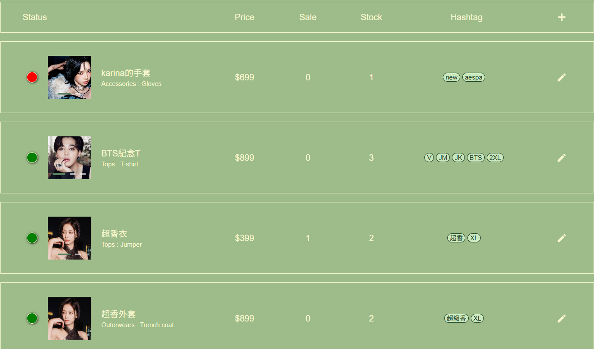
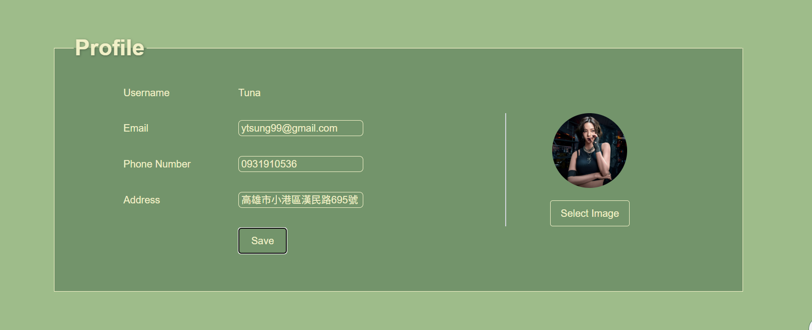
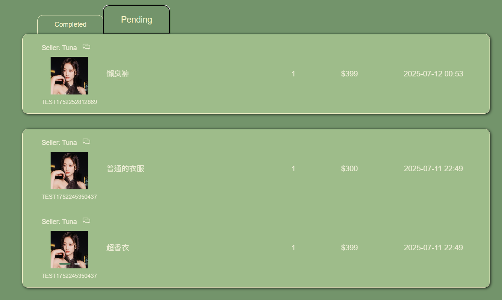

# Second-roject  
這是一個類似二手衣網站的東西  
除了優化 First Project 的相似功能完整性  
也會新增 Socket.io 來實現即時通訊，還能讓使用者自己上架商品  
這次將會嘗試善用 Framer motion 還有其餘JS套件來豐富UI  
嘗試出了很多想完成的動畫😪👍    
  
# 用了套件 Swiper.js 做 Carousal 跟像翻牌的東西，然後 Navbar 用 framer motion 做了點互動

  

# 用 framer 的 useScroll 做出像下滑後展開的感覺  
這邊因為下滑的時候卡頓苦惱過，結果是因為我原本放的圖片解析度太高  
挑個解析度低一點的版本轉成 webp 檔後就好很多了  
  
  

# product list 經由 hover 來改變 grid 比例，然後 add to cart 按鈕做出了一個比較麻煩的動畫出來  
add to cart 的按鈕是個很酷的嘗試，用 framer motion 的 useAnimation 做出一個分步驟的動畫
  
  

# Web socket實作 (socket.io)  
大部分即時通訊有的功能都有做  
打開聊天室的時候再連線，然後點選聊天室的時候向後端發送訂閱，關閉聊天室就斷連  
除了上述功能就，就是解決是一些渲染上的問題與歷史訊息的抓取  
已讀未讀功能: 待解鎖😴  
  
  
# 一些 first project 沒用過東西  
例如上下架與編輯商品、  
讓使用者編輯自己的基本資訊、  
已完成與正在進行中的訂單的追蹤 、  
以及placeholder往上跳 (發現MUI有下次可能用用看)  
  
  
  
  

